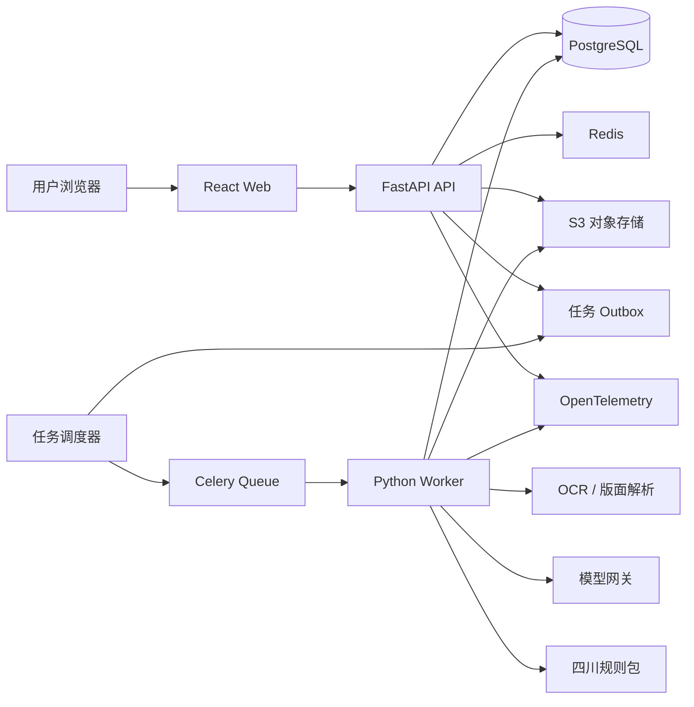
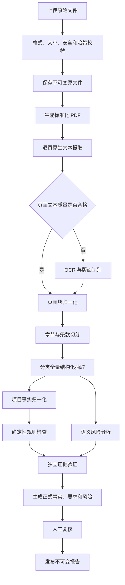
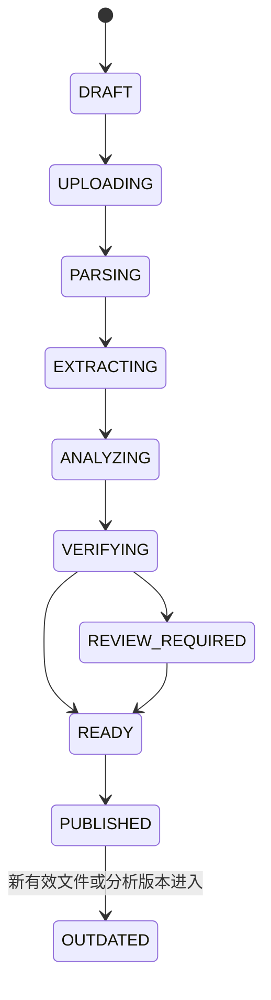

# 四川建筑施工招标文件智能解读与投标风险提示系统 MVP 技术架构

> 文档版本：V1.0  
> 文档状态：MVP 技术架构基线  
> 编制日期：2026-07-22  
> 关联文档：[四川建筑施工招标文件智能解读与投标风险提示系统-需求分析.md](./四川建筑施工招标文件智能解读与投标风险提示系统-需求分析.md)  
> 技术方向：React 前端 + Python 模块化单体后端 + Python 异步 Worker

---

## 1. 文档目的

本文档用于明确“四川建筑施工招标文件智能解读与投标风险提示系统”MVP 的技术架构、技术栈、模块边界、数据流、状态流、部署方式和质量保障策略，为后续数据库设计、接口设计、任务设计、开发实施和技术评审提供统一基线。

本文档重点解决以下问题：

1. 为什么 MVP 使用 Python 作为统一后端技术栈；
2. FastAPI API 与 Python Worker 如何分工；
3. 文档、OCR、AI、规则和报告如何形成可追溯的处理链；
4. 如何保证异步任务可恢复、可重试、幂等和可观测；
5. 如何保持模块化单体的高内聚、低耦合和长期可扩展性；
6. 哪些技术应在 MVP 阶段明确暂缓引入。

---

## 2. 技术结论

### 2.1 推荐技术路线

MVP 推荐采用以下总体技术路线：

```text
React + TypeScript 前端
        ↓
FastAPI 模块化单体 API
        ↓
PostgreSQL + Redis + S3 对象存储
        ↓
Celery Python Worker
        ↓
PyMuPDF + PaddleOCR + 大模型网关 + 确定性规则
```

后端统一使用 Python，但运行时拆分为多个独立进程：

- `API Process`：处理用户请求、权限、领域用例和查询；
- `Worker Process`：处理文档转换、页面解析、OCR、AI 抽取、风险验证和报告渲染；
- `Scheduler Process`：扫描待调度任务、补偿失败投递和执行周期性维护；
- `Migration Process`：执行数据库结构迁移，不参与业务请求。

这些进程共享同一套代码、领域模型、应用服务和 Schema，但不依赖共享内存状态。

### 2.2 为什么选择 Python 统一后端

本系统的主要技术复杂度来自：

- PDF 页面渲染、文本块和坐标提取；
- 扫描文件 OCR、版面和表格识别；
- 中文长文档分段、章节识别和条款切分；
- 大模型结构化抽取和输出校验；
- 规则计算、评测数据处理和模型质量分析；
- 报告渲染与数据科学工具链。

这些能力主要集中在 Python 生态。统一使用 Python 可以减少以下成本：

- Node.js 与 Python 之间的内部 HTTP 或 gRPC 通信；
- TypeScript DTO 与 Python Pydantic Schema 的双重维护；
- 跨语言错误处理、重试协议和序列化差异；
- 多运行时镜像、依赖和调试链路；
- AI 输出在两个技术栈之间反复转换。

选择 Python 不意味着采用脚本式架构。系统仍然必须以领域模块、应用服务、仓储接口和显式状态机组织代码。

### 2.3 架构形态

MVP 采用：

> 模块化单体 + 异步任务 + 独立计算进程

暂不采用微服务。模块间通过应用服务和明确接口协作，禁止直接跨模块修改对方的数据。

---

## 3. 架构原则

### 3.1 证据优先

- 正式事实、要求和风险必须关联有效证据；
- 证据必须定位到文件版本、页码、原文和页面坐标；
- AI 概括不能替代原始条款；
- 无证据输出只能保存为候选或失败结果，不能进入正式报告。

### 3.2 结构优先

- 模型输出必须先进入固定 Schema；
- 先形成 `ProjectFact`、`Requirement`、`RiskFinding` 和 `SourceCitation`；
- 报告只能消费经过验证的结构化数据；
- 不允许把自然语言报告作为业务事实来源。

### 3.3 确定性优先

以下能力优先使用程序和规则：

- 文件哈希和重复判断；
- 数字、金额、日期和分值计算；
- 评分总分闭合；
- 页面完整性检查；
- 状态流转和权限控制；
- 项目名称、编号、工期和限价一致性比较。

只有语义分类、隐式要求识别、风险说明等任务使用大模型。

### 3.4 显式状态

- API 进程内存不是任务状态来源；
- Celery 状态不是业务状态来源；
- PostgreSQL 中的 `AnalysisRun` 和 `AnalysisTask` 是分析状态事实来源；
- 所有状态转换必须由明确事件和应用服务驱动。

### 3.5 不可变与版本化

- 原始文件不可覆盖；
- 文档版本、解析器、OCR 模型、提示词、AI 模型、Schema 和规则包均需版本化；
- 发布报告是不可变快照；
- 新有效文件进入后，通过失效传播生成新的分析运行，不修改历史报告。

### 3.6 模块边界优先

- API 路由不直接访问 ORM；
- Celery Task 不承载完整业务逻辑；
- 领域模型不依赖 FastAPI、Celery、SQLAlchemy 或模型 SDK；
- 基础设施实现依赖领域接口，领域层不反向依赖基础设施；
- 四川地区规则存放在独立规则包，不写入通用风险模块。

---

## 4. 总体架构



### 4.1 请求与计算分离

用户请求只负责：

- 创建项目；
- 上传或确认文件；
- 发起分析；
- 查询进度；
- 查看和复核结果；
- 发布或导出报告。

以下任务不得在用户请求进程中执行：

- DOCX 转 PDF；
- PDF 页面渲染；
- OCR；
- 版面分析；
- 章节和条款切分；
- 大模型调用；
- 向量生成；
- 报告 PDF 渲染。

### 4.2 API 与 Worker 的边界

API 和 Worker 使用同一套应用服务，但入口不同：

| 入口 | 职责 | 禁止事项 |
|---|---|---|
| FastAPI 路由 | 鉴权、校验、调用应用用例、返回结果 | 不直接操作 ORM，不执行重计算 |
| Celery Task | 读取任务 ID、建立执行上下文、调用应用用例 | 不直接拼装领域数据，不成为状态机 |
| Application Service | 事务、状态转换、模块协作、幂等检查 | 不依赖 HTTP 或 Celery 请求对象 |
| Domain Service | 领域规则和推导 | 不访问数据库、Redis、对象存储和模型 SDK |
| Repository / Adapter | 持久化和外部能力实现 | 不包含跨模块业务决策 |

---

## 5. 技术栈清单

### 5.1 前端

| 能力 | 技术选型 | 用途 |
|---|---|---|
| 基础框架 | React 19 + TypeScript | Web 应用主体 |
| 构建工具 | Vite | 开发、构建和静态资源处理 |
| 路由 | React Router | 页面路由和权限路由 |
| 服务端状态 | TanStack Query | 请求缓存、重试、失效和轮询 |
| 表单 | React Hook Form + Zod | 表单状态和前端校验 |
| UI 组件 | Ant Design | 表格、筛选、表单、抽屉和状态组件 |
| 文档阅读器 | PDF.js | PDF 渲染、翻页、缩放和坐标高亮 |
| 实时进度 | SSE，轮询作为降级方案 | 分析进度和任务状态更新 |
| API 客户端 | Orval 或 openapi-typescript | 根据 OpenAPI 生成 TypeScript 类型和客户端 |
| 单元测试 | Vitest + Testing Library | 组件和纯逻辑测试 |
| 端到端测试 | Playwright | CI 或人工触发的关键流程测试 |

前端不保存业务分析状态，只保存筛选条件、展开状态、阅读位置等界面状态。

### 5.2 Python 后端

| 能力 | 技术选型 | 用途 |
|---|---|---|
| Python 版本 | Python 3.12 | 兼顾稳定性和 AI/OCR 依赖兼容性 |
| API 框架 | FastAPI | HTTP API、OpenAPI 和依赖注入入口 |
| 数据校验 | Pydantic 2 | 请求、任务、模型输出和配置校验 |
| ORM | SQLAlchemy 2 | 数据访问和事务管理 |
| 数据库迁移 | Alembic | 数据库 Schema 版本管理 |
| PostgreSQL 驱动 | psycopg 3 | 同步及异步数据库连接 |
| 异步任务 | Celery 5 | 后台任务、重试、路由和并发控制 |
| Redis 客户端 | redis-py | 队列、短期缓存和分布式互斥 |
| HTTP 客户端 | HTTPX | 模型服务和外部服务调用 |
| 包管理 | uv | 依赖锁定、虚拟环境和命令执行 |
| 代码检查 | Ruff | Lint 和 import 检查 |
| 类型检查 | Pyright | 静态类型检查 |
| 测试 | pytest | 单元、集成、任务和评测测试 |

具体补丁版本在项目初始化时锁定，升级必须通过依赖测试、黄金评测集和迁移验证。

### 5.3 数据与基础设施

| 能力 | 技术选型 | 用途 |
|---|---|---|
| 主数据库 | PostgreSQL 17 | 业务数据、任务状态和审计 |
| 向量扩展 | pgvector | 相似条款和冲突候选检索 |
| 队列与缓存 | Redis 7 | Celery Broker、短期缓存和互斥 |
| 对象存储 | S3 兼容存储 | 原文件、标准 PDF、页面图片和报告 |
| 本地对象存储 | MinIO | 仅用于本地和集成测试环境 |
| 反向代理 | Nginx 或云负载均衡 | TLS、请求大小和访问入口 |
| 容器 | Docker | 环境一致性和部署 |
| 本地编排 | Docker Compose | 开发、测试和早期试点 |
| 可观测协议 | OpenTelemetry | 日志、指标和链路统一关联 |
| 指标 | Prometheus + Grafana | 性能、任务和成本仪表盘 |
| 日志 | structlog + 日志后端 | 结构化日志和审计排障 |

### 5.4 文档与 AI

| 能力 | 技术选型 | 用途 |
|---|---|---|
| PDF 解析 | PyMuPDF | 文本块、页面、坐标和渲染 |
| PDF 辅助解析 | pdfplumber | 特定表格和文本提取补充 |
| OCR | PaddleOCR PP-StructureV3 | 中文 OCR、版面、表格和页眉页脚识别 |
| DOCX 转换 | LibreOffice Headless | 将 DOCX 统一转换为标准 PDF |
| DOCX 元数据 | python-docx | 读取文档属性和结构补充信息 |
| 图像处理 | Pillow + OpenCV | 旋转、裁剪、清晰度和图像预处理 |
| AI 输出校验 | Pydantic JSON Schema | 强约束模型结构化输出 |
| 模型接入 | 官方模型 SDK + ModelGateway | 供应商隔离、限流、成本和版本 |
| 报告模板 | Jinja2 | 生成确定性 HTML 报告 |
| PDF 报告 | WeasyPrint | HTML/CSS 转 PDF |

---

## 6. 代码仓库结构

建议使用单仓库管理前端、后端、基础设施和评测数据结构：

```text
tender-insight/
├── frontend/
│   ├── src/
│   │   ├── app/
│   │   ├── features/
│   │   ├── entities/
│   │   ├── shared/
│   │   └── generated-api/
│   └── tests/
├── backend/
│   ├── src/
│   │   ├── modules/
│   │   │   ├── identity/
│   │   │   ├── project/
│   │   │   ├── document/
│   │   │   ├── knowledge/
│   │   │   ├── analysis/
│   │   │   ├── risk/
│   │   │   ├── review/
│   │   │   ├── report/
│   │   │   └── audit/
│   │   ├── model_gateway/
│   │   ├── rule_packs/
│   │   │   └── sichuan_construction/
│   │   ├── workers/
│   │   ├── shared/
│   │   ├── bootstrap/
│   │   └── main.py
│   ├── migrations/
│   ├── tests/
│   └── pyproject.toml
├── evaluation/
│   ├── schemas/
│   ├── datasets/
│   ├── metrics/
│   └── runners/
├── infra/
│   ├── docker/
│   ├── compose/
│   ├── observability/
│   └── deployment/
└── docs/
    ├── architecture/
    ├── adr/
    └── api/
```

### 6.1 后端模块内部结构

每个业务模块采用相同的内部结构：

```text
module/
├── domain/
│   ├── entities/
│   ├── value_objects/
│   ├── services/
│   ├── events/
│   └── repositories.py
├── application/
│   ├── commands/
│   ├── queries/
│   ├── handlers/
│   └── dto.py
├── infrastructure/
│   ├── persistence/
│   ├── adapters/
│   └── models.py
└── api/
    ├── routes.py
    ├── schemas.py
    └── dependencies.py
```

禁止创建全局巨型 `services.py`、`models.py` 或 `utils.py`。共享代码只有在具有稳定语义和两个以上真实消费者时才能进入 `shared`。

---

## 7. 领域模块边界

| 模块 | 核心职责 | 不负责 |
|---|---|---|
| `identity` | 组织、用户、成员、角色和访问身份 | 项目业务权限判断之外的业务逻辑 |
| `project` | 项目生命周期、成员范围和项目状态 | 文件解析、OCR、风险生成 |
| `document` | 文件、不可变版本、页面、解析产物和版本关系 | 资格、评分和合同风险判断 |
| `knowledge` | 章节、条款、项目事实和结构化要求 | 分析任务调度和报告发布 |
| `analysis` | 分析运行、任务、状态机、重试和失效传播 | 作为项目事实来源 |
| `risk` | 规则执行、风险候选、风险发现和证据约束 | 修改原始条款和文件版本 |
| `review` | 人工确认、修订、驳回和复核历史 | 覆盖系统原始结论 |
| `report` | 报告快照、发布和导出 | 反向修改事实、要求和风险 |
| `audit` | 关键用户操作和安全审计 | 业务分析日志替代品 |
| `model_gateway` | 模型适配、限流、重试、成本和调用版本 | 领域风险决策 |
| `rule_packs` | 地区、工程类型和规则版本扩展 | 通用任务编排和持久化 |

### 7.1 模块协作原则

- 模块只暴露应用服务和只读查询接口；
- 禁止通过导入另一个模块的 ORM Model 修改其数据；
- 跨模块事务由应用层协调；
- 跨模块通知优先使用领域事件和事务 Outbox；
- 模块事件携带 ID 和必要上下文，不携带完整可变实体；
- 查询展示可以使用专用只读投影，但不能通过投影写回领域表。

---

## 8. 核心数据流



### 8.1 数据写入原则

每一阶段只生成自己的产物：

| 阶段 | 主要产物 |
|---|---|
| 文件接入 | `Document`、`DocumentVersion`、文件哈希和对象键 |
| 页面解析 | `Page`、`PageBlock`、OCR 状态和质量分数 |
| 结构识别 | `Section`、`Clause` |
| 事实抽取 | `ProjectFactCandidate`、`ProjectFact` |
| 要求抽取 | `RequirementCandidate`、`Requirement` |
| 风险分析 | `RiskCandidate`、`RiskFinding` |
| 证据校验 | `SourceCitation` 和验证结果 |
| 人工复核 | `ReviewAction` |
| 报告发布 | `ReportSnapshot` 和导出文件 |

候选结果和正式结果分离。模型原始响应只用于追踪和调试，不直接作为正式领域数据。

---

## 9. 文档处理架构

### 9.1 原文件与派生文件

对象存储至少区分：

```text
original/       用户上传的不可变原文件
canonical/      标准化 PDF
pages/          页面渲染图片和缩略图
artifacts/      OCR、版面和表格中间产物
reports/        发布后的报告文件
quarantine/     未通过安全检查的文件
```

数据库只保存对象键、哈希、大小、MIME、版本和状态，不保存大文件二进制。

### 9.2 DOCX 处理

DOCX 本身没有跨环境稳定的物理页码。为保证证据定位，处理流程为：

1. 保存原始 DOCX；
2. 使用固定版本 LibreOffice 和固定字体环境转换为 PDF；
3. 保存标准化 PDF 及转换器版本；
4. 后续页面解析、证据页码和高亮全部基于该 PDF；
5. 报告同时标明原文件和标准化文件的关系。

字体包、LibreOffice 版本和渲染参数必须进入部署镜像并保持可复现。

### 9.3 PDF 页面处理

每页处理步骤：

1. 读取页尺寸、旋转角度和文本层；
2. 提取文本块、字符坐标和阅读顺序候选；
3. 计算文本质量、乱码率、字符密度和覆盖率；
4. 质量不足时执行页面渲染和 OCR；
5. 识别标题、正文、表格、页眉页脚、页码和印章区域；
6. 将所有坐标转换为统一的页面归一化坐标；
7. 保存解析器版本、OCR 版本和质量分数；
8. 失败页面进入明确失败状态，不允许静默跳过。

### 9.4 坐标模型

证据坐标统一使用左上角为原点、取值范围为 `0～1` 的归一化矩形：

```text
x = 原始横坐标 / 页面宽度
y = 原始纵坐标 / 页面高度
w = 区域宽度 / 页面宽度
h = 区域高度 / 页面高度
```

同时保存：

- 页面原始宽高；
- 页面旋转角度；
- 坐标来源；
- 坐标转换版本；
- 引用原文哈希。

前端 PDF.js 阅读器根据 viewport 完成归一化坐标到显示坐标的映射。

### 9.5 解析适配器

文档模块只依赖抽象解析端口：

```text
DocumentConverter
PageRenderer
NativeTextExtractor
OcrEngine
LayoutAnalyzer
TableExtractor
ClauseSegmenter
```

PyMuPDF、PaddleOCR、LibreOffice 和未来云 OCR 都是适配器实现。更换工具不应修改 `Document`、`Page`、`Clause` 和 `SourceCitation` 的领域定义。

---

## 10. AI 分析架构

### 10.1 AI 使用边界

适合使用模型：

- 章节和条款语义分类；
- 资格条件结构化抽取；
- 隐式否决风险识别；
- 评分项和证明材料拆解；
- 合同风险语义识别；
- 跨条款语义冲突候选；
- 风险说明和行动建议生成。

不应主要依赖模型：

- 金额、日期和分值计算；
- 页数和页面完整性；
- 文件哈希与版本顺序；
- 项目编号精确比较；
- 限价数学判断；
- 权限、状态流转和租户隔离。

### 10.2 模型网关

模型网关提供统一能力：

- 文本生成；
- 严格结构化输出；
- Embedding；
- 超时和重试；
- 供应商限流；
- Token 和费用记录；
- 模型、参数和提示词版本记录；
- 敏感日志脱敏；
- 供应商切换和灰度评测。

领域模块只能依赖模型网关接口，不能直接导入具体供应商 SDK。

### 10.3 模型分级

MVP 建议配置两类模型能力，而不是让所有任务使用同一模型：

| 模型层级 | 适合任务 |
|---|---|
| 经济模型 | 章节分类、显式字段抽取、材料类型识别 |
| 强模型 | 隐式否决风险、复杂评分拆解、合同风险和独立验证 |

模型供应商和具体型号不写入领域代码，而是由评测结果和部署策略决定。

### 10.4 结构化输出

每类模型任务拥有独立的 Pydantic Schema，至少包含：

- `task_type`；
- `schema_version`；
- `input_clause_ids`；
- 结构化业务字段；
- 证据条款 ID；
- 原文摘录；
- 置信度；
- 不确定原因；
- 是否需要人工复核。

模型不得自行生成文件 ID、页码或坐标。页码和坐标只能通过输入条款 ID 回查系统事实。

### 10.5 AI 结果入库流程

```text
模型原始响应
→ JSON 解析
→ Pydantic Schema 校验
→ 输入条款 ID 校验
→ 引用原文一致性校验
→ 领域枚举和阈值校验
→ 确定性规则复核
→ 独立验证任务
→ 正式领域记录
```

任一环节失败都必须记录明确失败类型，并进入重试或人工复核。

### 10.6 检索策略

系统采用混合检索，但不同任务使用不同策略：

| 内容 | 策略 |
|---|---|
| 找出全部资格和否决要求 | 全量条款扫描 |
| 金额、日期、编号 | 精确字段和规则检索 |
| 用户关键词查询 | 标准化文本检索 |
| 相似条款和潜在冲突 | pgvector 语义候选检索 |
| 报告生成 | 只查询已验证结构化结果 |

不得用 Top-K RAG 代替“找出全部要求”的全量扫描。

### 10.7 缓存与成本控制

模型调用缓存键至少包含：

```text
task_type
+ input_content_hash
+ model_provider
+ model_name
+ model_parameters_hash
+ prompt_version
+ schema_version
+ rule_pack_version
```

命中完全一致的缓存键时可复用原始结构化输出，但仍需经过当前领域校验流程。

---

## 11. 确定性规则架构

### 11.1 规则分类

| 类型 | 示例 | 实现方式 |
|---|---|---|
| 数据一致性 | 项目编号、工期、限价冲突 | 纯 Python 领域规则 |
| 数值规则 | 评分总分、限价、金额阈值 | Decimal 和确定性函数 |
| 日期规则 | 截止时间先后、延期替代 | 时区明确的日期值对象 |
| 文本规则 | 明确否决关键词和模式 | 版本化词典与正则 |
| 地区规则 | 四川房建、市政特定要求 | 独立规则包 |
| 语义规则 | 隐式风险、复杂合同含义 | 模型候选 + 规则验证 |

### 11.2 四川规则包

规则包建议包含：

```text
sichuan_construction/
├── manifest
├── qualification
├── rejection
├── scoring
├── timeline
├── pricing
├── contract
├── dictionaries
└── tests
```

规则包 Manifest 至少记录：

- 规则包名称；
- 版本；
- 适用地区；
- 适用工程类型；
- 生效时间范围；
- 依据来源；
- 规则集合版本；
- 兼容的核心 Schema 版本。

MVP 不建设通用低代码规则平台。复杂规则使用可测试的 Python 代码，稳定的词典和阈值使用版本化配置。

---

## 12. 异步任务架构

### 12.1 任务队列划分

建议按资源特征划分队列：

```text
document.convert       DOCX 转 PDF、文件标准化
document.parse         原生文本和页面结构提取
document.ocr           OCR、版面和表格识别
knowledge.segment      章节和条款切分
knowledge.extract      事实、资格、评分和时间抽取
risk.analyze           规则和语义风险分析
risk.verify            高风险独立验证
embedding.generate     条款向量生成
report.render          报告 HTML 和 PDF 渲染
maintenance            补偿、清理和完整性扫描
```

不同队列设置独立并发度、超时、重试次数和资源配额。

### 12.2 任务数据要求

Celery 消息只传递必要标识：

```text
analysis_task_id
organization_id
trace_id
```

不在队列消息中传递：

- 文件二进制；
- 整页 OCR 内容；
- 完整招标文件文本；
- 可变业务实体；
- 模型访问凭证。

Worker 根据任务 ID 从数据库和对象存储加载当前任务所需数据。

### 12.3 状态事实来源

Celery 负责执行能力，PostgreSQL 负责业务状态：

```text
AnalysisRun
└── AnalysisTask
    ├── task_type
    ├── status
    ├── attempt
    ├── idempotency_key
    ├── input_hash
    ├── worker_version
    ├── started_at
    ├── heartbeat_at
    ├── finished_at
    ├── failure_code
    └── output_reference
```

不得根据 Celery Result Backend 推导报告是否完整。

### 12.4 Outbox 投递

为避免“数据库提交成功但任务未进入队列”，采用事务 Outbox：

1. 应用服务在同一数据库事务中创建 `AnalysisTask` 和 `OutboxEvent`；
2. Scheduler 使用行锁领取未投递事件；
3. 投递 Celery 后记录投递时间和 Broker 消息 ID；
4. 投递失败保留事件并退避重试；
5. Worker 仍通过幂等键防止重复执行。

### 12.5 幂等键

任务幂等键至少由以下信息组成：

```text
document_version_id
+ task_type
+ page_or_clause_range
+ parser_or_model_version
+ prompt_version
+ schema_version
+ rule_pack_version
```

数据库通过唯一约束防止同一分析版本产生重复正式结果。

### 12.6 重试和失败

| 失败类型 | 处理策略 |
|---|---|
| 临时网络错误 | 指数退避自动重试 |
| 模型限流 | 延迟重试并降低并发 |
| Schema 不合法 | 原任务有限重试，随后人工复核 |
| 文件损坏 | 不重试，标记用户处理 |
| OCR 低质量 | 切换参数或适配器后重试 |
| Worker 崩溃 | 心跳超时后重新领取 |
| 证据缺失 | 不创建正式结论 |
| 连续失败 | 分析运行进入部分失败或人工处理状态 |

重试不得隐式覆盖上一次结果。每次尝试保留执行记录和失败原因。

---

## 13. 状态流设计

### 13.1 分析运行状态



异常状态：

- `UPLOAD_FAILED`；
- `PARSE_PARTIAL`；
- `ANALYSIS_FAILED`；
- `CANCELLED`；
- `OUTDATED`。

### 13.2 状态转换规则

- 状态转换由 `analysis` 模块统一执行；
- API、Worker 和前端不能直接写状态字段；
- 状态转换必须验证前置状态；
- 每次转换记录事件、原因、操作者和时间；
- 进度由已完成任务权重计算，不使用虚假时间进度；
- 存在失败页面或未完成任务时，报告不得显示完整。

---

## 14. 核心数据存储

### 14.1 PostgreSQL 中的主要数据

```text
Organization
User
OrganizationMembership
Project
ProjectMember
Document
DocumentVersion
DocumentRelation
Page
PageBlock
Section
Clause
ProjectFactCandidate
ProjectFact
RequirementCandidate
Requirement
RiskCandidate
RiskFinding
SourceCitation
AnalysisRun
AnalysisTask
TaskAttempt
ReviewAction
ReportSnapshot
AuditLog
OutboxEvent
ModelInvocation
```

### 14.2 结构化字段与 JSONB

关系字段用于：

- 业务主键和外键；
- 状态、类型和等级；
- 金额、日期、页码和分值；
- 租户、项目和版本范围；
- 查询、排序和唯一约束。

JSONB 用于：

- 模型原始结构化输出；
- OCR 或版面引擎的供应商特定元数据；
- 页面块扩展属性；
- 发布报告快照中的展示配置。

不得把所有正式领域数据保存为一个大 JSONB。

### 14.3 金额、时间和分值

- 金额使用 `NUMERIC` 和 Python `Decimal`；
- 分值使用 `NUMERIC`，禁止使用二进制浮点数参与闭合计算；
- 所有时间保存为带时区时间；
- 项目默认业务时区明确设置为 `Asia/Shanghai`；
- 原文中的模糊时间同时保存原文和解析状态；
- 无法确定的值保存为候选，不自动补全。

### 14.4 检索

MVP 使用 PostgreSQL 完成：

- 精确字段检索；
- 规范化文本查询；
- 项目内关键词检索；
- pgvector 相似条款检索；
- 项目、文件和版本过滤。

暂不引入 Elasticsearch 或独立向量数据库。只有当真实数据证明 PostgreSQL 无法满足查询延迟或中文检索质量时再通过 ADR 引入。

---

## 15. 多租户、权限与安全

### 15.1 租户隔离

- `Organization` 是租户边界；
- 所有租户业务表包含 `organization_id`；
- 仓储接口必须显式接收租户上下文；
- PostgreSQL Row-Level Security 作为第二道防线；
- 后台任务必须携带并验证租户 ID；
- 对象存储按不可猜测对象键隔离；
- 不允许通过文件名构造对象路径。

应用事务开始时设置当前租户上下文，事务结束后自动清除，禁止使用进程级全局变量保存租户。

### 15.2 身份认证

MVP 支持：

- 账号密码登录；
- Argon2id 密码哈希；
- 短期 Access Token；
- 服务端保存且可撤销的 Refresh Token；
- Refresh Token 只保存哈希；
- 登录失败限流和安全审计；
- 管理员、分析人员、复核人员和只读人员角色。

未来企业单点登录通过 OIDC 适配器接入，不修改领域用户模型。

### 15.3 文件安全

- 根据文件魔数检查真实类型，不能只信任扩展名；
- 校验空文件、页数、大小和压缩异常；
- 上传后计算 SHA-256；
- 未完成安全检查的文件进入隔离区；
- 生产环境配置恶意文件扫描能力；
- 下载使用短期授权链接或后端流式授权；
- 原始文件和报告默认不公开；
- 对象存储开启服务端加密和版本保护。

### 15.4 模型数据安全

- 模型请求只发送完成当前原子任务所需条款；
- 不默认发送整本招标文件；
- 不在普通日志中记录完整原文；
- 记录供应商、模型、请求哈希、Token 和费用；
- 明确供应商数据保留、训练和部署地域政策；
- 不允许跨租户复用原文、人工标注和模型缓存；
- 评测数据必须经过授权和脱敏。

### 15.5 审计

至少审计：

- 登录和退出；
- 文件上传、查看、下载和删除；
- 文件版本关系修改；
- 分析发起、取消和重试；
- 风险确认、修订和驳回；
- 报告发布和下载；
- 用户、角色和项目成员变更。

审计日志只追加，不允许普通业务用户修改。

---

## 16. API 设计

### 16.1 基本规则

- API 前缀使用 `/api/v1`；
- 使用资源和用例语义，不直接暴露数据库表；
- 请求和响应全部使用 Pydantic Schema；
- OpenAPI 是前后端接口契约来源；
- 错误响应使用统一问题详情结构；
- 列表默认分页并限制最大页大小；
- 创建分析运行等关键写操作支持幂等键；
- 上传文件使用预签名地址或受控分片上传；
- 不在前端暴露模型、数据库和对象存储凭证。

### 16.2 API 类型

| 类型 | 示例 |
|---|---|
| 命令接口 | 创建项目、确认版本、发起分析、复核风险、发布报告 |
| 查询接口 | 项目列表、任务进度、风险筛选、页面证据、报告快照 |
| 文件接口 | 获取上传凭证、完成上传、获取授权下载地址 |
| 进度接口 | SSE 事件流或轮询快照 |
| 管理接口 | 用户、成员、角色和审计查询 |

命令接口返回已接受的业务结果或异步任务标识，不返回虚假完成状态。

---

## 17. 前端架构

### 17.1 功能模块

```text
identity
project-list
project-create
document-management
analysis-progress
report-overview
qualification
rejection-risk
scoring-matrix
timeline
contract-risk
document-viewer
review
report-version
```

### 17.2 状态管理

- 服务端业务状态由 TanStack Query 管理；
- 表单状态由 React Hook Form 管理；
- URL 保存筛选、分页和可分享的阅读位置；
- 全局 Store 只保存用户会话和少量纯界面状态；
- 不把分析运行、风险列表或文件状态复制到全局 Store；
- SSE 事件到达后使对应 Query 失效或局部更新。

### 17.3 文档阅读器

阅读器建议独立为高内聚模块，包含：

- 文件与章节目录；
- PDF 页面虚拟化渲染；
- 页码、缩放和旋转；
- 归一化坐标高亮层；
- 风险、要求和事实侧栏；
- 上一条、下一条证据导航；
- OCR 质量和解析状态；
- 引用位置修正入口。

阅读器只消费 `SourceCitation` 和页面元数据，不自行推导风险证据。

---

## 18. 报告架构

### 18.1 发布流程

```text
已验证领域数据
→ 生成报告快照 JSON
→ 冻结快照版本
→ Jinja2 渲染 HTML
→ WeasyPrint 渲染 PDF
→ 保存对象存储
→ 记录文件哈希和渲染器版本
```

### 18.2 不可变报告

发布报告至少记录：

- 报告 ID 和版本；
- 项目和分析运行 ID；
- 文件版本集合；
- 规则包版本；
- 模型、提示词和 Schema 版本；
- 解析覆盖率；
- 未解析页面和未完成项；
- 事实、要求、风险和复核快照；
- 生成时间、发布人和免责声明；
- HTML/PDF 对象键及哈希。

报告发布后不反向修改领域数据。新增文件或规则版本只会使历史报告进入 `OUTDATED`，不会改变历史内容。

---

## 19. 可观测性

### 19.1 统一关联标识

日志、指标和 Trace 至少关联：

- `trace_id`；
- `organization_id`；
- `project_id`；
- `analysis_run_id`；
- `analysis_task_id`；
- `document_version_id`；
- `model_invocation_id`。

日志不得记录密码、Token、对象存储签名和完整敏感原文。

### 19.2 核心指标

| 类别 | 指标 |
|---|---|
| API | 请求量、P95、错误率、鉴权失败 |
| 上传 | 文件大小、成功率、重复率、安全检查失败率 |
| 解析 | 页面数、解析成功率、OCR 比例、低质量页和失败页 |
| 任务 | 队列长度、等待时间、执行时间、重试率和卡死任务 |
| AI | 调用次数、Token、成本、Schema 失败率和证据失败率 |
| 业务 | 风险数量、人工确认率、修订率和驳回率 |
| 报告 | 生成时间、失败率、下载量和过期报告数量 |
| 基础设施 | 数据库连接、慢查询、Redis 内存和对象存储错误 |

### 19.3 业务 Trace

一次分析运行应能追踪：

```text
文件接入
→ 页面处理
→ 条款切分
→ 事实和要求抽取
→ 风险分析
→ 独立验证
→ 报告快照
```

模型调用 Trace 只记录元数据和哈希，原始请求响应存放在受权限控制的专用存储中。

---

## 20. 测试与质量保障

### 20.1 测试分层

| 层级 | 目标 |
|---|---|
| 领域单元测试 | 状态机、金额、分值、日期和版本规则 |
| 应用用例测试 | 事务、幂等、失效传播和模块协作 |
| 仓储集成测试 | PostgreSQL 约束、RLS、事务和并发 |
| Worker 测试 | 重试、心跳、任务恢复和产物提交 |
| 契约测试 | OpenAPI、Celery Payload 和模型 Schema |
| 文档回归测试 | 固定 PDF/DOCX 的页数、文本、坐标和表格 |
| AI 评测 | 黄金集上的召回率、准确率和证据正确率 |
| 前端组件测试 | 筛选、复核、状态和证据展示 |
| 端到端测试 | 上传到报告发布的关键流程 |

### 20.2 测试基础设施

- 使用 pytest 作为后端统一测试入口；
- 使用 Testcontainers 启动真实 PostgreSQL、Redis 和对象存储；
- 不使用 SQLite 代替 PostgreSQL 集成测试；
- 固定解析器、字体和 OCR 版本生成文档回归基线；
- 外部模型测试使用录制响应或专用评测环境；
- 核心规则禁止只依赖 Mock 测试；
- 数据库迁移必须测试从空库创建和前一版本升级。

### 20.3 黄金评测集

评测集至少覆盖：

- 原生文本 PDF；
- 扫描 PDF；
- 混合文本和扫描页；
- 复杂表格；
- 多文件和澄清补遗；
- 项目名称、工期、限价和时间冲突；
- 显式及隐式否决条款；
- 评分总分闭合和不闭合；
- 低质量 OCR 页面；
- 文件提及但缺失的附件。

模型、提示词、OCR、解析器或规则升级前必须运行固定评测集，不以模型自评代替人工标注指标。

---

## 21. 开发规范

### 21.1 Python 规范

- 所有公开函数、应用服务和仓储接口必须有类型标注；
- Pydantic Schema 与领域实体分离；
- SQLAlchemy Model 与领域实体分离；
- 路由只处理协议转换和用例调用；
- Task 只处理任务上下文和用例调用；
- 使用显式依赖组装，不在领域层使用全局容器；
- 禁止循环导入；
- 禁止隐式数据库 Session；
- 禁止在模块导入时创建网络连接；
- 时间、金额、状态和风险等级使用值对象或枚举；
- 新增或修改的代码必须包含必要的多行简体中文注释，说明业务约束、状态边界和非显然设计原因；
- 注释解释“为什么”，不重复代码表面行为。

### 21.2 数据库规范

- 所有外键、唯一约束和检查约束显式声明；
- 租户数据索引以 `organization_id` 为前导列进行评估；
- 幂等规则必须有数据库唯一约束兜底；
- 枚举变更必须有迁移策略；
- 删除默认采用受审计的生命周期流程；
- 对象存储产物和数据库记录通过状态和哈希保持一致；
- 禁止业务模块使用无约束的通用 EAV 表。

### 21.3 AI-Friendly Architecture

为便于开发者和 AI 理解、修改系统：

- 每个模块提供 README，说明职责、入口、状态和依赖；
- 用例名称使用明确业务动词；
- 状态机集中定义并配套转换表；
- 错误使用稳定错误码，不依赖自然语言匹配；
- 规则、Schema 和提示词使用稳定 ID 和版本；
- ADR 记录重要架构决策；
- 示例数据和测试使用清晰的业务场景名称；
- 单文件职责清晰，避免巨型模块和动态魔法注册；
- 优先显式组合，不通过运行时扫描自动发现核心业务逻辑。

---

## 22. 部署架构

### 22.1 本地开发

Docker Compose 启动：

```text
frontend
api
worker-default
worker-ocr
scheduler
postgres
redis
minio
otel-collector
```

前端和后端代码可在宿主机运行，PostgreSQL、Redis、MinIO 等依赖通过容器提供。

### 22.2 试点生产环境

MVP 初期不使用 Kubernetes，推荐：

- 托管 PostgreSQL；
- 托管 Redis；
- 云对象存储；
- 1～2 个 API 容器；
- 独立通用 Worker 容器；
- 独立 OCR Worker 容器；
- 独立 Scheduler 容器；
- 云负载均衡或 Nginx；
- 集中日志和指标服务。

OCR Worker 根据评测结果选择 CPU 或 GPU 实例。API 不与 GPU 运行时打包在同一镜像中。

### 22.3 镜像划分

建议至少分为：

| 镜像 | 内容 |
|---|---|
| `backend-base` | 领域、应用、数据库和通用依赖 |
| `backend-api` | FastAPI、API 入口和轻量依赖 |
| `backend-worker` | Celery、文档和模型依赖 |
| `backend-ocr-worker` | PaddleOCR、OpenCV 和可选 GPU 运行时 |
| `frontend` | 构建后的静态 Web 资源 |

代码可以来自同一仓库，但运行时镜像不应把不必要的 OCR/GPU 依赖打入 API。

### 22.4 备份与恢复

- PostgreSQL 定期全量备份和时间点恢复；
- 对象存储开启版本或生命周期保护；
- Redis 不作为唯一业务数据来源；
- 报告快照、原始文件和标准化 PDF 纳入备份范围；
- 定期执行恢复演练；
- Worker 重启后通过数据库任务状态恢复未完成工作；
- 卡死任务由心跳扫描器重新调度。

---

## 23. CI/CD

### 23.1 后端流水线

```text
依赖锁定检查
→ Ruff
→ Pyright
→ 单元测试
→ PostgreSQL 集成测试
→ 数据库迁移测试
→ 文档解析回归测试
→ 镜像构建
→ 漏洞扫描
```

### 23.2 前端流水线

```text
依赖锁定检查
→ TypeScript 检查
→ Lint
→ 单元测试
→ 生产构建
→ API 生成代码一致性检查
→ 镜像构建
```

### 23.3 AI 质量门禁

以下变更触发黄金评测集：

- 模型或 Embedding 变更；
- 提示词变更；
- 模型输出 Schema 变更；
- OCR 或版面模型变更；
- 条款切分算法变更；
- 四川规则包变更；
- 证据定位算法变更。

低于需求基线指标时不得自动发布到生产环境。

---

## 24. 分阶段实施建议

### 24.1 阶段 0：领域和评测基线

- 固化核心实体、枚举和状态机；
- 收集 10～30 份招标文件；
- 人工制作理想报告；
- 建立黄金评测集；
- 确定坐标、证据和页面数据结构；
- 验证 3～5 份代表性文件的解析效果。

### 24.2 阶段 1：基础平台

- 组织、用户和登录；
- 项目和项目成员；
- 对象存储和安全上传；
- 文件版本、哈希和替代关系；
- PostgreSQL、Redis、Celery 和 Outbox；
- 分析运行及任务状态机；
- 基础日志、指标和审计。

### 24.3 阶段 2：文档解析

- DOCX 标准化 PDF；
- PDF 原生文本和页面坐标；
- 页面质量判断；
- PaddleOCR 和版面分析；
- 页面块、标题、表格和页眉页脚；
- 文档阅读器和坐标高亮；
- 失败页面重试和完整性展示。

### 24.4 阶段 3：结构化分析

- 章节和条款切分；
- 项目事实抽取；
- 资格要求抽取；
- 否决风险抽取；
- 评分矩阵和时间节点；
- 确定性规则；
- 证据验证和模型网关；
- 模型成本和质量记录。

### 24.5 阶段 4：复核和报告

- 风险总览和分类页面；
- 人工确认、修订和驳回；
- 系统结果与人工结果并存；
- 完整性状态；
- 不可变报告快照；
- HTML/PDF 导出；
- 新文件进入后的报告过期传播。

### 24.6 阶段 5：试点增强

- 澄清补遗差异分析；
- 合同风险增强；
- 材料清单和责任分工；
- 规则包管理；
- 性能和成本优化；
- 权限和审计强化；
- 根据真实瓶颈决定是否引入新基础设施。

---

## 25. MVP 暂不引入的技术

| 暂不引入 | 原因 |
|---|---|
| 微服务 | 增加分布式事务、部署和接口维护成本 |
| Kubernetes | 试点规模尚不需要复杂编排平台 |
| Kafka | 当前任务规模使用 Celery 和 Redis 足够 |
| Elasticsearch/OpenSearch | PostgreSQL 可满足早期检索和过滤 |
| 独立向量数据库 | 项目内条款规模有限，pgvector 足够 |
| LangChain 重型编排 | 核心状态、Schema 和重试需要显式控制 |
| 自研工作流引擎 | 先由数据库状态机和 Celery 完成 |
| 低代码规则平台 | 规则尚未稳定，容易过早抽象 |
| 模型微调 | 优先积累高质量人工评测和修订数据 |
| 私有化大模型 | MVP 先验证产品价值和质量成本 |
| CAD/BIM 深度解析 | 超出施工招标文件解读的 MVP 边界 |

是否引入上述技术必须以真实指标和 ADR 为依据，不能因为预期规模提前增加复杂度。

---

## 26. 主要技术风险与应对

| 风险 | 影响 | 应对措施 |
|---|---|---|
| Python 项目退化为脚本集合 | 模块耦合和维护困难 | 强制领域模块、应用服务和仓储边界 |
| OCR 质量不足 | 条款遗漏和证据错误 | 页面质量评分、适配器、失败可见和人工修正 |
| DOCX 页码不稳定 | 引用不可复现 | 固定环境转换标准化 PDF |
| Celery 重复执行 | 重复结果和状态异常 | 数据库幂等键、唯一约束和原子提交 |
| Redis 丢失任务 | 分析长期停滞 | PostgreSQL Outbox、任务扫描和补偿调度 |
| 大模型无依据结论 | 业务风险和信任下降 | Schema、条款 ID、证据校验和独立验证 |
| 长文档漏项 | 召回率不足 | 全量条款扫描，不以 Top-K 代替 |
| 模型成本过高 | 单项目亏损 | 任务分级、缓存、预算和调用指标 |
| 跨租户数据泄露 | 严重安全事故 | 租户仓储、RLS、对象存储隔离和审计 |
| Worker 占用过多资源 | API 性能下降 | API、通用 Worker 和 OCR Worker 独立部署 |
| 解析器升级改变结果 | 报告不可复现 | 解析器版本和文档回归基线 |
| 规则包污染通用核心 | 难以扩展其他地区 | 四川规则包独立、接口稳定 |

---

## 27. 架构决策记录

项目启动时至少建立以下 ADR：

| ADR | 决策 |
|---|---|
| ADR-001 | 后端统一采用 Python |
| ADR-002 | 采用模块化单体而非微服务 |
| ADR-003 | API 与 Worker 使用同一代码库、独立进程 |
| ADR-004 | PostgreSQL 是业务状态事实来源 |
| ADR-005 | Celery 只负责投递和执行，不承担业务状态机 |
| ADR-006 | 原始文件不可变，DOCX 统一生成标准化 PDF |
| ADR-007 | 所有正式结论必须关联可验证证据 |
| ADR-008 | 模型、提示词、Schema、解析器和规则全部版本化 |
| ADR-009 | 四川规则作为独立扩展包 |
| ADR-010 | 报告使用不可变快照 |

每个 ADR 应说明背景、决策、备选方案、正面影响、负面影响和重新评估条件。

---

## 28. 技术验收清单

### 28.1 架构

- [ ] API 和 Worker 可以独立启动、停止和扩容；
- [ ] 领域层不依赖 FastAPI、Celery、SQLAlchemy 和模型 SDK；
- [ ] 不存在跨模块直接修改数据库实体；
- [ ] 四川规则未写入通用风险模块；
- [ ] 所有状态转换具有统一入口和测试。

### 28.2 文件和证据

- [ ] 原始文件不可覆盖并具有 SHA-256；
- [ ] DOCX 生成可复现的标准化 PDF；
- [ ] 每页具有明确解析状态和质量分数；
- [ ] 证据可定位到文件版本、页码、原文和坐标；
- [ ] 前端缩放和旋转后高亮位置仍然正确；
- [ ] 未解析页面会影响报告完整性。

### 28.3 异步任务

- [ ] 数据库事务和任务投递通过 Outbox 协调；
- [ ] 任务具有稳定幂等键和数据库唯一约束；
- [ ] Worker 崩溃后任务可以恢复；
- [ ] 重试不会产生重复事实、要求和风险；
- [ ] Celery 状态不用于判断报告完整性；
- [ ] 卡死任务可以通过心跳检测和补偿扫描处理。

### 28.4 AI 和规则

- [ ] 模型输出通过固定 Pydantic Schema；
- [ ] 模型不能自行生成页码和文件 ID；
- [ ] 无证据候选不能进入正式报告；
- [ ] 金额、日期和评分计算使用确定性规则；
- [ ] 高风险结论执行独立验证；
- [ ] 模型、提示词、Schema 和规则版本可追溯；
- [ ] 黄金评测集可以自动运行并输出指标。

### 28.5 安全和运维

- [ ] 不同组织无法查询或下载彼此数据；
- [ ] 对象存储文件默认不可公开访问；
- [ ] 模型和存储凭证不暴露给前端；
- [ ] 日志不记录完整敏感原文和凭证；
- [ ] 关键操作具有不可修改的审计记录；
- [ ] 数据库和对象存储具有可验证的备份恢复流程；
- [ ] API、任务、OCR 和模型成本具有可观测指标。

---

## 29. 官方技术资料

- [FastAPI 官方文档](https://fastapi.tiangolo.com/)
- [Pydantic 官方文档](https://docs.pydantic.dev/)
- [SQLAlchemy 2 官方文档](https://docs.sqlalchemy.org/en/20/)
- [Alembic 官方文档](https://alembic.sqlalchemy.org/)
- [Celery 官方文档](https://docs.celeryq.dev/)
- [PostgreSQL 官方文档](https://www.postgresql.org/docs/)
- [PostgreSQL Row-Level Security](https://www.postgresql.org/docs/current/ddl-rowsecurity.html)
- [pgvector 官方项目](https://github.com/pgvector/pgvector)
- [PyMuPDF 官方文档](https://pymupdf.readthedocs.io/)
- [PaddleOCR PP-StructureV3](https://www.paddleocr.ai/main/en/version3.x/algorithm/PP-StructureV3/PP-StructureV3.html)
- [PDF.js 官方文档](https://mozilla.github.io/pdf.js/)
- [OpenTelemetry 官方文档](https://opentelemetry.io/docs/)
- [WeasyPrint 官方文档](https://doc.courtbouillon.org/weasyprint/stable/)

---

## 30. 最终技术基线

本系统 MVP 的最终推荐技术基线为：

```text
前端
React + TypeScript + Vite + Ant Design + PDF.js

后端
Python 3.12 + FastAPI + Pydantic 2

数据
PostgreSQL + SQLAlchemy 2 + Alembic + pgvector

异步任务
Celery + Redis + PostgreSQL Outbox

文档处理
LibreOffice + PyMuPDF + PaddleOCR + OpenCV

AI
模型官方 SDK + ModelGateway + Pydantic JSON Schema + 版本化规则包

存储与报告
S3 兼容对象存储 + Jinja2 + WeasyPrint

质量与运维
pytest + Testcontainers + OpenTelemetry + Prometheus + Grafana + Docker
```

这套架构的核心不是“全部使用 Python”，而是：

1. 使用一种后端语言降低开发和维护成本；
2. 使用 API 与 Worker 进程隔离在线请求和重计算；
3. 使用领域模块和应用服务控制代码边界；
4. 使用 PostgreSQL 保存显式、可恢复的业务状态；
5. 使用不可变文件、版本化产物和证据引用保证可追溯；
6. 使用结构化抽取、确定性规则和人工复核共同控制 AI 风险；
7. 保持解析器、OCR、模型、对象存储和地区规则均可替换。

在上述边界不被破坏的前提下，未来接入企业资料、投标文件终检、新地区规则或私有化模型时，可以沿现有模块扩展，无需推翻招标文件分析主链路。
