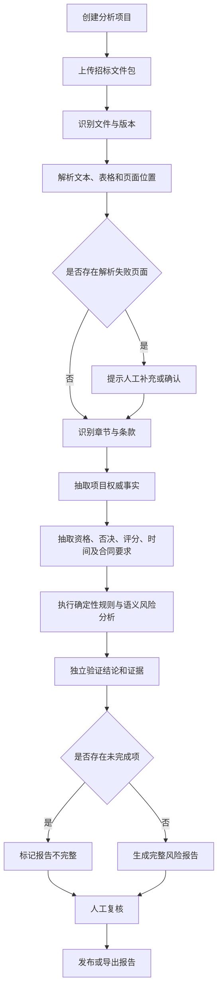
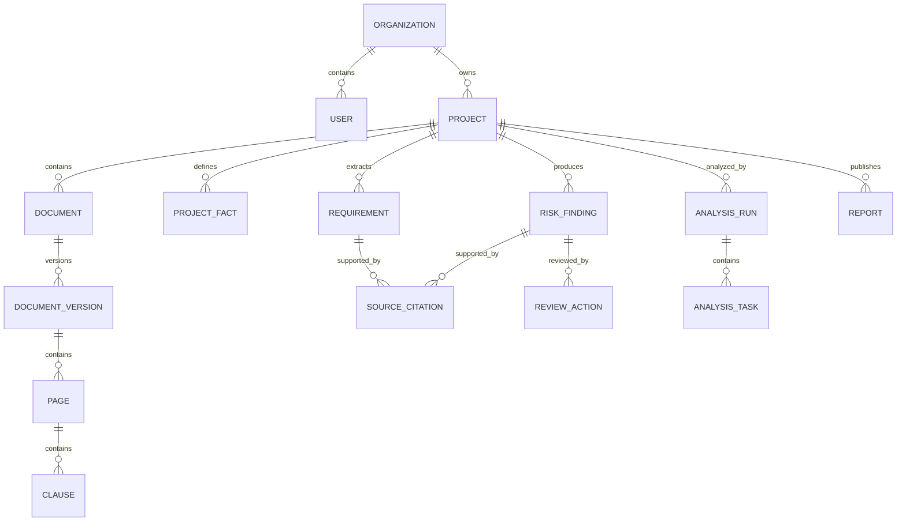
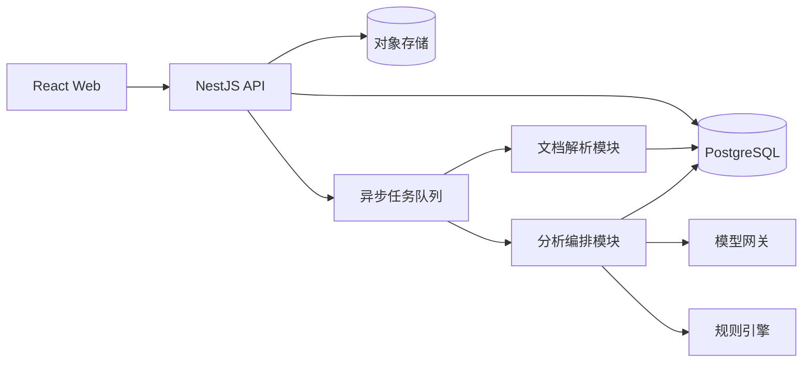

# 四川建筑施工招标文件智能解读与投标风险提示系统需求分析

> 文档版本：V1.0  
> 文档状态：MVP 需求基线  
> 编制日期：2026-07-22  
> 适用范围：四川省房屋建筑和市政工程施工招标项目  
> 产品阶段：从招标文件解读切入，暂不处理投标文件合规审查

---

## 1. 文档概述

### 1.1 编写目的

本文档用于明确“四川建筑施工招标文件智能解读与投标风险提示系统”MVP 的产品目标、用户范围、业务流程、功能边界、核心数据、质量标准及验收条件，为后续原型设计、技术设计、开发测试、试点交付和产品迭代提供统一依据。

### 1.2 目标读者

- 产品负责人
- 业务分析人员
- 前端、后端及 AI 工程人员
- 测试与质量保障人员
- 建筑施工企业投标负责人
- 招投标咨询与标书制作人员
- 参与试点验收的行业专家

### 1.3 术语定义

| 术语 | 定义 |
|---|---|
| 招标文件包 | 同一招标项目下的招标文件、附件、澄清、补遗、图纸目录、工程量清单等文件集合 |
| 招标要求 | 招标文件中要求投标人满足、响应、承诺或提供证明的事项 |
| 否决投标风险 | 未满足时可能造成投标无效、资格审查不通过或被否决的要求 |
| 评分项 | 评标办法中可量化得分的企业、人员、业绩、技术、信用或报价条件 |
| 风险发现 | 系统基于招标文件识别出的资格、程序、合同、技术或文件一致性风险 |
| 证据引用 | 支撑系统结论的原文、文件名称、版本、章节、页码及页面位置 |
| 项目权威事实 | 从当前有效招标文件中确认的项目名称、编号、工期、限价等唯一标准值 |
| 人工复核 | 由用户对系统提取结果、风险结论或证据引用进行确认、修订或驳回 |
| 当前有效版本 | 结合原始招标文件、澄清和补遗后的最新生效版本 |

---

## 2. 产品定义

### 2.1 产品定位

本产品是一套面向四川省建筑施工企业及招投标服务机构的招标文件智能解读工具。系统将复杂、篇幅较长的招标文件转换为结构化、可追溯、可执行的投标准备清单与风险报告。

产品核心价值不是替代投标人员作出最终判断，而是帮助投标人员更快完成以下工作：

- 判断项目基本投标门槛；
- 汇总资格条件和证明材料；
- 发现可能造成否决投标的关键条款；
- 将评分标准转换为可执行的准备清单；
- 提取全部关键时间节点；
- 识别合同、履约和报价相关风险；
- 发现招标文件内部或不同版本之间的冲突；
- 为后续投标文件编制和终检提供结构化依据。

### 2.2 一句话产品描述

> 上传四川房建或市政施工招标文件包，系统生成一份带原文和页码证据的资格要求、否决风险、评分项、时间节点、材料清单及合同风险报告。

### 2.3 MVP 核心目标

1. 将人工首次阅读和整理招标文件的时间显著缩短。
2. 提高资格条件、否决条款和关键时间节点的提取完整度。
3. 所有正式结论均可追溯到原始文件和具体页码。
4. 建立可复用的四川房建、市政施工招标要求领域模型。
5. 通过人工复核形成高质量评测数据，为后续接入企业资料和投标文件奠定基础。

### 2.4 非目标

MVP 明确不提供以下能力：

- 不自动生成整本投标文件；
- 不判断某家企业必然满足或不满足投标资格；
- 不承诺发现全部风险或保证投标不被否决；
- 不预测中标概率；
- 不推荐具体投标报价；
- 不代替造价人员完成完整组价；
- 不对 CAD、BIM 或完整施工图进行深度技术审查；
- 不提供确定性的法律意见；
- 不自动提交投标或操作电子交易平台；
- 不处理不同投标人之间的协同编标；
- 不将客户文档用于其他客户或跨租户训练。

### 2.5 产品原则

- **证据优先**：无原文和页码支撑的内容不得作为正式风险结论。
- **结构优先**：先建立要求、事实、风险和证据模型，再生成自然语言报告。
- **确定性优先**：可以用程序和规则判断的问题，不依赖大模型自由推理。
- **显式状态**：解析、抽取、分析、复核和报告均具有明确状态。
- **人工兜底**：高风险结论必须允许并鼓励人工复核。
- **不确定性透明**：无法解析或证据不足时明确显示“无法判断”。
- **版本可追溯**：原始文件、澄清和补遗必须形成完整版本链。
- **模块化扩展**：未来接入企业资料和投标文件时，不推翻现有核心模型。

---

## 3. 背景与问题分析

### 3.1 当前业务现状

四川建筑施工招标文件通常包含数百页正文及多份附件，信息分散在公告、投标人须知、评标办法、合同条款、技术标准、工程量清单说明和补遗文件中。投标人员需要在有限时间内完成阅读、摘录、判断、分工和材料准备。

### 3.2 核心痛点

#### 3.2.1 信息分散

同一项要求可能同时出现在投标人须知前附表、资格审查条件、评标办法和投标文件格式中，人工容易遗漏或只看到其中一处。

#### 3.2.2 致命条款不突出

否决投标条件散落在多个章节，部分使用“投标无效”“不予通过”“不进入下一阶段评审”等不同表述，人工搜索关键词无法保证完整覆盖。

#### 3.2.3 版本变化难以追踪

澄清、补遗和延期通知可能修改资格条件、投标截止时间、评分规则或文件格式，原始清单容易失效。

#### 3.2.4 评分条件难以转化为行动

评标办法描述的是评委如何打分，但投标团队需要的是“准备什么材料、由谁负责、放在哪个章节、何时完成”。二者之间缺少结构化转换。

#### 3.2.5 合同风险容易被后置

团队通常优先关注资格和评分，付款、结算、价格调整、违约责任和索赔时限等履约风险可能到中标后才被重视。

#### 3.2.6 结果缺乏可审计性

普通大模型摘要可能没有准确引用，无法证明是否覆盖全部页面，也无法让业务人员快速回到原文复核。

### 3.3 产品机会

公开招标文件可以持续获取，且四川房建、市政施工项目具有相对统一的标准文件体系。系统可以先基于招标文件形成“项目要求库”，在没有投标文件的情况下提供独立价值；后续接入企业资料和投标文件后，再扩展为资格预检和投标文件合规终检系统。

---

## 4. 用户与角色

### 4.1 目标客户

MVP 优先面向：

1. 四川省内具有稳定投标需求的建筑施工企业；
2. 服务四川施工企业的投标咨询、标书制作机构；
3. 工程咨询、造价咨询或项目管理机构中的投标支持团队。

### 4.2 核心用户角色

| 角色 | 主要任务 | 核心诉求 |
|---|---|---|
| 企业负责人/经营负责人 | 决定是否参与项目 | 快速看到门槛、机会和重大风险 |
| 投标负责人 | 统筹整个投标准备过程 | 获得完整清单、时间线和责任分工依据 |
| 资格商务人员 | 准备企业、人员、业绩资料 | 不遗漏资格和证明材料要求 |
| 技术标人员 | 编制施工组织设计 | 明确技术评分项、暗标和重点难点要求 |
| 造价人员 | 编制报价 | 掌握限价、报价规则和合同价格风险 |
| 法务/合同人员 | 审查合同条款 | 快速定位付款、结算、违约和索赔风险 |
| 复核人员 | 独立终审分析结果 | 能回到原文、确认或修订系统结论 |
| 企业管理员 | 管理用户和项目权限 | 保证租户、项目和文件访问安全 |

### 4.3 典型用户故事

- 作为投标负责人，我希望上传全部招标文件后获得项目概览，以便快速判断是否值得深入分析。
- 作为资格商务人员，我希望获得资格要求和材料清单，以便向公司内部收集资料。
- 作为投标负责人，我希望看到全部疑似否决条款及原文，以便安排独立复核。
- 作为技术标人员，我希望将评分项转换成章节准备清单，以便确保技术方案覆盖评分要求。
- 作为造价人员，我希望看到限价、报价约束和价格调整风险，以便提前评估报价边界。
- 作为法务人员，我希望集中查看合同风险及来源条款，以便进行合同审查。
- 作为复核人员，我希望点击风险后直接定位到原始页面，以便确认系统是否理解正确。
- 作为企业负责人，我希望比较多个项目的门槛和风险，以便决定投标优先级。

---

## 5. 业务边界

### 5.1 MVP 支持范围

- 地域：四川省；
- 行业：房屋建筑和市政工程；
- 阶段：施工招标投标准备阶段；
- 输入：招标公告、招标文件、澄清、补遗、延期通知及常规附件；
- 文件格式：PDF、扫描 PDF、DOCX；
- 单项目支持多个文件和多个版本；
- 输出：在线风险报告及可导出报告；
- 分析对象：招标文件自身，不判断具体投标文件是否响应。

### 5.2 延后范围

- 公路、水利、铁路、电力、矿山等专业工程；
- 造价清单的完整计价和组价；
- CAD、BIM、复杂施工图语义分析；
- 招标平台自动下载、自动登录或 CA 操作；
- 企业证照和人员资料自动比对；
- 投标文件证据匹配与终检；
- 招投标全流程项目管理；
- 私有化部署和离线模型部署。

---

## 6. 核心业务流程



### 6.1 用户主流程

1. 用户创建项目并录入基础名称。
2. 用户上传招标文件及相关附件。
3. 系统识别文件类型、页数、版本和可能的重复文件。
4. 系统异步完成解析、OCR、章节识别和条款抽取。
5. 用户在进度页面查看每个文件和页面的处理状态。
6. 系统生成项目事实、要求及风险发现。
7. 系统对高风险结论执行独立验证。
8. 用户按风险类别查看报告并定位原文。
9. 用户确认、修订或驳回系统结论。
10. 用户发布当前报告版本并导出。

### 6.2 分析运行状态

```text
DRAFT
→ UPLOADING
→ PARSING
→ EXTRACTING
→ ANALYZING
→ VERIFYING
→ REVIEW_REQUIRED / READY
→ PUBLISHED
```

异常状态包括：

- `UPLOAD_FAILED`：上传失败；
- `PARSE_PARTIAL`：部分页面无法解析；
- `ANALYSIS_FAILED`：分析任务失败；
- `CANCELLED`：用户取消；
- `OUTDATED`：新增文件或版本后，旧报告已过期。

状态必须由明确事件驱动，不允许依赖页面或内存中的隐式状态。

---

## 7. 功能需求

优先级定义：

- P0：MVP 上线必需；
- P1：试点阶段重要；
- P2：后续增强。

### 7.1 组织、用户与权限

| 编号 | 需求 | 优先级 |
|---|---|---|
| FR-AUTH-001 | 用户可通过账号密码登录和退出系统 | P0 |
| FR-AUTH-002 | 企业数据必须按组织隔离 | P0 |
| FR-AUTH-003 | 支持管理员、分析人员、复核人员、只读人员四类角色 | P1 |
| FR-AUTH-004 | 项目可限制为指定成员可见 | P1 |
| FR-AUTH-005 | 记录文件查看、下载、报告发布等关键操作日志 | P1 |

### 7.2 项目管理

| 编号 | 需求 | 优先级 |
|---|---|---|
| FR-PROJ-001 | 用户可创建、查看、编辑和归档分析项目 | P0 |
| FR-PROJ-002 | 项目至少记录名称、地区、行业、项目类型和创建人 | P0 |
| FR-PROJ-003 | 支持按项目名称、编号、状态和创建时间查询 | P1 |
| FR-PROJ-004 | 项目列表展示当前分析状态、风险数量和更新时间 | P0 |
| FR-PROJ-005 | 新增有效文件后自动将现有报告标记为已过期 | P0 |
| FR-PROJ-006 | 支持复制项目结构，但不复制客户敏感内容 | P2 |

### 7.3 文件上传与版本管理

| 编号 | 需求 | 优先级 |
|---|---|---|
| FR-DOC-001 | 单个项目支持上传多个 PDF、扫描 PDF 和 DOCX 文件 | P0 |
| FR-DOC-002 | 上传前校验格式、大小、空文件和损坏文件 | P0 |
| FR-DOC-003 | 为原始文件计算哈希，识别完全重复文件 | P0 |
| FR-DOC-004 | 用户可标记文件类型：招标文件、澄清、补遗、延期通知、附件或其他 | P0 |
| FR-DOC-005 | 系统尝试自动识别文件类型，用户可以修正 | P1 |
| FR-DOC-006 | 支持为文件设置发布日期、生效顺序和替代关系 | P0 |
| FR-DOC-007 | 原始文件只追加版本，不直接覆盖 | P0 |
| FR-DOC-008 | 支持查看每个文件的解析页数、失败页数和处理状态 | P0 |
| FR-DOC-009 | 用户可重新触发单个失败文件或页面的解析 | P1 |
| FR-DOC-010 | 不支持的格式应明确提示转换建议 | P0 |

### 7.4 文档解析与 OCR

| 编号 | 需求 | 优先级 |
|---|---|---|
| FR-PARSE-001 | 提取每页文本并保留原始页码 | P0 |
| FR-PARSE-002 | 对无文本层或文本质量不足的页面自动执行 OCR | P0 |
| FR-PARSE-003 | 保留段落、标题、表格和页面坐标信息 | P0 |
| FR-PARSE-004 | 识别目录及章节层级 | P0 |
| FR-PARSE-005 | 标记空白页、低质量页、旋转页和解析失败页 | P0 |
| FR-PARSE-006 | 对重复页眉页脚进行标记，避免干扰语义分析 | P1 |
| FR-PARSE-007 | 支持表格内容按行列结构存储 | P1 |
| FR-PARSE-008 | 支持从分析结果跳转到原始页面位置 | P0 |
| FR-PARSE-009 | 任何未解析页面必须计入完整性状态 | P0 |

### 7.5 项目权威事实抽取

系统应提取并统一维护以下字段：

- 项目名称；
- 招标项目编号；
- 标段名称和编号；
- 招标人；
- 招标代理机构；
- 建设地点；
- 项目规模；
- 招标范围；
- 资金来源；
- 计划工期；
- 质量标准；
- 最高投标限价；
- 评标方法；
- 资格审查方式；
- 是否接受联合体；
- 投标截止时间；
- 开标时间和地点；
- 投标有效期；
- 投标保证金金额和形式。

| 编号 | 需求 | 优先级 |
|---|---|---|
| FR-FACT-001 | 每个事实必须包含原文、文件版本和页码引用 | P0 |
| FR-FACT-002 | 同一字段存在多个候选值时不得自动静默覆盖 | P0 |
| FR-FACT-003 | 系统应根据版本顺序推荐当前有效值 | P0 |
| FR-FACT-004 | 用户可确认或修正权威事实 | P0 |
| FR-FACT-005 | 事实修正记录必须保留操作人、时间和原值 | P1 |
| FR-FACT-006 | 权威事实变更后，受影响风险自动重新分析 | P1 |

### 7.6 资格要求分析

系统应识别：

- 企业营业执照和独立法人要求；
- 施工总承包或专业承包资质；
- 安全生产许可证；
- 企业类似业绩；
- 项目经理注册专业、等级、B 证、业绩和在建限制；
- 技术负责人职称、专业和业绩；
- 施工员、质量员、安全员等项目班子要求；
- 社保、劳动关系和人员所属单位要求；
- 财务、纳税和信用要求；
- 联合体组成和职责要求；
- 基本账户及保证金来源要求；
- 四川省或指定平台登记要求；
- 不存在关联关系、失信、处罚或行贿记录等要求。

| 编号 | 需求 | 优先级 |
|---|---|---|
| FR-QUAL-001 | 每项资格要求生成独立结构化记录 | P0 |
| FR-QUAL-002 | 记录要求对象、条件、时间范围和阈值 | P0 |
| FR-QUAL-003 | 列出建议准备的证明材料 | P0 |
| FR-QUAL-004 | 区分强制资格条件和加分条件 | P0 |
| FR-QUAL-005 | 无企业资料时显示“需要企业确认”，不得显示“已满足” | P0 |
| FR-QUAL-006 | 对要求内容不完整或语义模糊的条款标记人工复核 | P0 |
| FR-QUAL-007 | 支持按企业、人员、业绩、财务、信用和联合体分类查看 | P1 |

### 7.7 否决投标风险分析

系统应识别显式和隐式否决条件，包括但不限于：

- 投标无效；
- 否决投标；
- 不予通过；
- 拒绝接收；
- 不进入下一阶段评审；
- 视为未响应；
- 未按要求提交；
- 签字盖章不符合要求；
- 逾期、未解密或保证金不符合要求；
- 实质性内容不响应；
- 报价超过最高投标限价或违反报价规则；
- 技术暗标出现识别性信息；
- 提供虚假材料或存在禁止投标情形。

| 编号 | 需求 | 优先级 |
|---|---|---|
| FR-REJECT-001 | 每个风险关联具体触发条件和可能后果 | P0 |
| FR-REJECT-002 | 区分明确否决条款和疑似高风险条款 | P0 |
| FR-REJECT-003 | 聚合同一要求在不同章节的多个证据 | P0 |
| FR-REJECT-004 | 对相互冲突的否决条件生成冲突风险 | P0 |
| FR-REJECT-005 | 支持按资格、形式、响应、报价、技术和程序分类 | P1 |
| FR-REJECT-006 | 用户可确认、降级、升级或驳回风险 | P0 |

### 7.8 评分项分析

| 编号 | 需求 | 优先级 |
|---|---|---|
| FR-SCORE-001 | 将评标办法拆解为独立评分项 | P0 |
| FR-SCORE-002 | 提取每项分值、满分条件和分档规则 | P0 |
| FR-SCORE-003 | 提取需要提供的证明材料和材料形式 | P0 |
| FR-SCORE-004 | 区分客观评分和主观评分 | P1 |
| FR-SCORE-005 | 生成评分项准备清单 | P0 |
| FR-SCORE-006 | 识别评分项与投标文件格式之间的覆盖缺口 | P1 |
| FR-SCORE-007 | 统计已识别总分与招标文件总分是否一致 | P0 |
| FR-SCORE-008 | 分值无法完整还原时标记报告不完整 | P0 |

### 7.9 关键时间节点

| 编号 | 需求 | 优先级 |
|---|---|---|
| FR-TIME-001 | 提取文件获取、提疑、踏勘、保证金、投标、开标、解密等时间 | P0 |
| FR-TIME-002 | 时间记录必须包含时区、来源和适用标段 | P0 |
| FR-TIME-003 | 识别不同章节或版本中的时间冲突 | P0 |
| FR-TIME-004 | 澄清或延期文件更新后，原时间标记为已失效 | P0 |
| FR-TIME-005 | 按时间顺序生成投标日程 | P0 |
| FR-TIME-006 | 支持导出日程或生成提醒 | P2 |

### 7.10 材料准备清单

| 编号 | 需求 | 优先级 |
|---|---|---|
| FR-MAT-001 | 根据资格、评分、承诺和格式要求生成材料清单 | P0 |
| FR-MAT-002 | 每项材料关联用途、要求和原文证据 | P0 |
| FR-MAT-003 | 标记材料是否需要原件、扫描件、截图、签字或盖章 | P0 |
| FR-MAT-004 | 标记材料有效期、时间区间和指定查询平台 | P1 |
| FR-MAT-005 | 用户可以设置负责人、完成状态和备注 | P1 |
| FR-MAT-006 | 同一材料服务多个要求时应复用，不重复创建 | P1 |

### 7.11 技术要求提示

MVP 不生成完整施工组织设计，只提取编制约束和评分覆盖要求。

| 编号 | 需求 | 优先级 |
|---|---|---|
| FR-TECH-001 | 提取施工组织设计章节和评分模块 | P0 |
| FR-TECH-002 | 提取工程重点、难点和关键技术要求 | P1 |
| FR-TECH-003 | 提取质量、安全、环保、进度及季节性施工要求 | P1 |
| FR-TECH-004 | 提取暗标格式、页数、字体、颜色和识别性信息限制 | P0 |
| FR-TECH-005 | 输出技术标章节建议及来源，不直接输出完整方案 | P0 |

### 7.12 报价与工程量清单提示

| 编号 | 需求 | 优先级 |
|---|---|---|
| FR-PRICE-001 | 提取最高投标限价及组成说明 | P0 |
| FR-PRICE-002 | 提取暂列金额、暂估价和不可竞争费用要求 | P1 |
| FR-PRICE-003 | 提取报价唯一性、完整性和异常报价相关要求 | P0 |
| FR-PRICE-004 | 识别不同章节中的限价冲突 | P0 |
| FR-PRICE-005 | 对结构化清单文件仅记录元数据，MVP 不完成完整计价 | P0 |

### 7.13 合同与履约风险提示

系统至少覆盖：

- 预付款、进度款和付款周期；
- 结算方式和审计条款；
- 履约保证金、质量保证金；
- 价格调整及材料涨价风险；
- 工期顺延条件；
- 逾期违约金及上限；
- 工程变更和现场签证程序；
- 索赔通知和索赔时限；
- 暂停施工、解除合同和退场；
- 工程保险和第三方责任；
- 缺陷责任期和保修责任；
- 发包人与承包人的风险划分。

| 编号 | 需求 | 优先级 |
|---|---|---|
| FR-CONTRACT-001 | 合同风险必须引用具体条款 | P0 |
| FR-CONTRACT-002 | 风险输出使用“提示/建议复核”，不得作为法律结论 | P0 |
| FR-CONTRACT-003 | 支持按资金、工期、违约、变更、索赔和保修分类 | P1 |
| FR-CONTRACT-004 | 对明显不一致或缺少上限的条款标记重点关注 | P1 |
| FR-CONTRACT-005 | 用户可记录企业内部接受意见 | P2 |

### 7.14 文件一致性与冲突分析

系统应识别：

- 项目名称、编号或标段不一致；
- 工期、质量标准、限价不一致；
- 资格要求在不同章节不一致；
- 评分规则与投标文件格式不一致；
- 公告、正文和附件时间不一致；
- 联合体要求不一致；
- 澄清文件已修改但旧要求仍被引用；
- 目录与正文缺章；
- 招标文件提及但未上传的附件。

| 编号 | 需求 | 优先级 |
|---|---|---|
| FR-CONFLICT-001 | 每个冲突至少展示两个相互矛盾的证据 | P0 |
| FR-CONFLICT-002 | 根据文件版本推荐当前有效要求 | P0 |
| FR-CONFLICT-003 | 无法确定优先级时必须标记人工确认 | P0 |
| FR-CONFLICT-004 | 支持查看冲突对比视图 | P1 |

### 7.15 风险报告与人工复核

| 编号 | 需求 | 优先级 |
|---|---|---|
| FR-REPORT-001 | 报告展示项目概览、资格要求、否决风险、评分项、时间线、材料、技术、报价、合同和冲突 | P0 |
| FR-REPORT-002 | 用户可按类别、风险等级、状态和关键词筛选 | P0 |
| FR-REPORT-003 | 点击结论可查看原文并定位页面 | P0 |
| FR-REPORT-004 | 用户可确认、修订、驳回和添加备注 | P0 |
| FR-REPORT-005 | 用户修订不得覆盖系统原始结果 | P0 |
| FR-REPORT-006 | 报告显示解析覆盖率、未处理页和无法判断项 | P0 |
| FR-REPORT-007 | 支持生成不可变的报告版本 | P0 |
| FR-REPORT-008 | 支持导出 Markdown 或 PDF 报告 | P1 |
| FR-REPORT-009 | 报告必须包含免责声明和生成时间 | P0 |
| FR-REPORT-010 | 新增文件后旧报告显示“已过期” | P0 |

### 7.16 反馈与评测数据

| 编号 | 需求 | 优先级 |
|---|---|---|
| FR-FEEDBACK-001 | 记录用户对每条结论的确认、修订和驳回 | P0 |
| FR-FEEDBACK-002 | 记录修订原因及正确内容 | P1 |
| FR-FEEDBACK-003 | 只有经过授权和脱敏的数据可进入评测集 | P0 |
| FR-FEEDBACK-004 | 评测数据必须记录来源、版本和标注人 | P1 |
| FR-FEEDBACK-005 | 支持导出经过审批的匿名评测样本 | P2 |

---

## 8. 风险分类与状态模型

### 8.1 风险类别

| 类别 | 说明 | 典型示例 |
|---|---|---|
| QUALIFICATION | 资格准入 | 企业资质、项目经理、业绩、社保 |
| REJECTION | 否决投标 | 未签章、未提交保证金、实质性不响应 |
| TIMELINE | 时间与程序 | 提疑、上传、解密、保证金截止时间 |
| SCORING | 评分与得分 | 评分材料、分档条件、技术评分模块 |
| MATERIAL | 材料准备 | 合同、证书、截图、承诺函 |
| TECHNICAL | 技术标约束 | 施工组织设计、暗标、重点难点 |
| PRICE | 报价约束 | 最高限价、暂估价、不可竞争费用 |
| CONTRACT | 合同履约 | 付款、结算、违约、索赔、质保 |
| CONFLICT | 文件冲突 | 不同章节或版本要求不一致 |
| COMPLETENESS | 文件完整性 | 附件缺失、页面解析失败、分值不闭合 |

### 8.2 风险等级

| 等级 | 定义 | 示例 |
|---|---|---|
| CRITICAL | 可能直接导致投标无效或无法参与 | 资质不满足、逾期提交、未解密 |
| HIGH | 可能导致资格或响应审查不通过 | 业绩证明链不足、签章要求不明确 |
| MEDIUM | 可能造成失分、成本增加或履约风险 | 评分材料不足、价格调整风险 |
| LOW | 一般提醒或优化建议 | 材料命名、章节组织建议 |
| UNKNOWN | 证据不足或规则不明确 | 文件冲突且无法确定生效版本 |

### 8.3 风险复核状态

```text
DETECTED
→ NEEDS_REVIEW
→ CONFIRMED / MODIFIED / REJECTED
→ RESOLVED
```

### 8.4 单条风险的数据要求

每条风险至少包含：

- 风险编号；
- 风险标题；
- 风险类别；
- 风险等级；
- 检查状态；
- 招标文件原文；
- 文件名称；
- 文件版本；
- 章节；
- 页码和页面坐标；
- 风险原因；
- 可能后果；
- 建议动作；
- 置信度；
- 是否需要人工复核；
- 模型、提示词和规则版本；
- 创建及更新时间。

---

## 9. 核心领域模型



### 9.1 核心实体

| 实体 | 职责 |
|---|---|
| Organization | 租户及数据隔离边界 |
| User | 用户身份和角色 |
| Project | 一次招标分析的业务聚合根 |
| Document | 逻辑文件及文件类型 |
| DocumentVersion | 文件不可变版本、哈希和生效顺序 |
| Page | 页面文本、OCR状态、坐标及质量 |
| Clause | 按章节拆分后的条款 |
| ProjectFact | 项目权威事实及候选值 |
| Requirement | 资格、评分、时间、材料等结构化要求 |
| RiskFinding | 基于事实和要求产生的风险发现 |
| SourceCitation | 结论与原文之间的证据关系 |
| AnalysisRun | 一次完整分析运行 |
| AnalysisTask | 单文件、单章节或单要求的原子任务 |
| ReviewAction | 人工确认、修订和驳回记录 |
| Report | 发布后的不可变报告快照 |

### 9.2 聚合边界

- `Project` 负责项目级生命周期，不直接承担 OCR 或模型调用。
- `Document` 负责文件和版本，不负责业务风险判断。
- `Requirement` 负责表达招标要求，不保存用户企业是否满足的状态。
- `RiskFinding` 负责风险及证据，不修改原始条款。
- `AnalysisRun` 负责过程编排，不作为业务事实来源。
- `Report` 是发布快照，不反向修改领域数据。

---

## 10. 关键业务规则

### 10.1 证据规则

1. 正式结论至少有一条有效证据引用。
2. 文件冲突至少引用两条不同证据。
3. 引用必须能够定位到文件版本和页码。
4. OCR 低质量页面产生的结论必须标记人工复核。
5. 模型生成的概括不得替代原始条款。

### 10.2 版本规则

1. 原始文件不得覆盖，只能新增版本。
2. 澄清、补遗和延期通知可修改原要求。
3. 文件发布时间不能单独决定法律优先级，用户可人工设置替代关系。
4. 新增有效版本后，受影响事实、要求、风险和报告必须失效或重新计算。
5. 无法确定生效顺序时，不得静默选择其中一个值。

### 10.3 完整性规则

出现以下任一情况，报告必须显示“不完整”：

- 存在未解析页面；
- 存在缺失但被正文引用的附件；
- 评分总分无法闭合；
- 关键章节未识别；
- 招标文件正文解析失败；
- 分析任务未完成；
- 新文件上传后尚未重新分析。

### 10.4 结论规则

1. 无企业资料时，资格要求只能输出“需要确认”，不能输出“已满足”。
2. 合同风险只能输出风险提示和复核建议。
3. 无足够证据时输出“无法判断”，不得补全或猜测。
4. 高风险结论应经过独立验证任务。
5. 人工修订与系统原始结果同时保留。

### 10.5 幂等与重试规则

- 相同文件哈希和相同分析版本不得重复创建业务结果；
- 单页解析、单章节抽取和单风险验证均可独立重试；
- 重试不得生成重复要求或重复风险；
- 模型或规则版本变化时允许主动发起重新分析。

---

## 11. AI 分析需求

### 11.1 总体策略

系统不得把整本招标文件一次性提交给模型进行自由总结。应采用“全量分段抽取、结构化汇总、定向分析、独立验证”的流程。

```text
页面解析
→ 章节识别
→ 条款切分
→ 分类型全量抽取
→ 项目事实归一化
→ 规则检查
→ 语义风险分析
→ 证据复核
→ 报告生成
```

### 11.2 模型任务边界

适合使用模型的任务：

- 章节和条款语义分类；
- 资格条件结构化抽取；
- 隐式否决风险识别；
- 评分项拆解；
- 合同风险语义识别；
- 跨条款语义冲突发现；
- 风险说明和行动建议生成。

不应主要依赖模型的任务：

- 数字、金额和日期比较；
- 项目名称、编号和人员名称一致性；
- 页面完整性；
- 评分总分计算；
- 文件哈希和版本判断；
- 限价数学比较；
- 状态流转和权限控制。

### 11.3 模型输出约束

- 所有任务必须输出符合固定 Schema 的结构化结果；
- 不接受只有自然语言的分析输出；
- 每条抽取结果必须携带输入条款 ID；
- 模型不得创建不存在的页码或文件名称；
- 输出解析失败时进入重试或人工复核；
- 模型、提示词、Schema 和规则均需版本化；
- 单次任务上下文只包含完成该任务所需内容。

### 11.4 检索策略

- 以章节和条款结构检索为主；
- 精确关键词、全文检索和向量检索结合；
- 金额、日期、编号等字段优先使用精确检索；
- “找出全部要求”必须通过全量扫描，不依赖 Top-K RAG；
- 报告生成只能消费已验证的结构化事实和风险。

### 11.5 模型失败处理

- 超时：自动重试，超过阈值进入人工处理；
- Schema 不合法：执行修复或重新请求；
- 证据缺失：不得保存为正式结论；
- 置信度低：标记人工复核；
- 连续失败：分析运行进入部分失败状态，不影响已完成任务查看。

---

## 12. 页面与交互需求

### 12.1 页面清单

| 页面 | 核心内容 | 优先级 |
|---|---|---|
| 登录页 | 登录、错误提示 | P0 |
| 项目列表 | 项目状态、风险摘要、搜索 | P0 |
| 创建项目页 | 项目基础信息、文件上传 | P0 |
| 文件管理页 | 文件类型、版本、页数、解析状态 | P0 |
| 分析进度页 | 阶段、任务、失败页和重试 | P0 |
| 报告总览页 | 风险数量、项目事实、完整性 | P0 |
| 资格要求页 | 分类清单、材料要求、证据 | P0 |
| 否决风险页 | 高风险列表、筛选、复核 | P0 |
| 评分矩阵页 | 分值、条件、证明材料 | P0 |
| 时间线页 | 时间节点、版本变化 | P0 |
| 合同风险页 | 分类风险和条款引用 | P1 |
| 文档阅读器 | 原文、页码、证据高亮 | P0 |
| 报告版本页 | 发布、历史版本、导出 | P1 |

### 12.2 报告总览

报告总览至少展示：

- 当前报告是否完整；
- 文件数量和总页数；
- 已解析和失败页数；
- CRITICAL、HIGH、MEDIUM 风险数量；
- 资格要求数量；
- 否决条款数量；
- 评分总分还原情况；
- 最近关键截止时间；
- 尚未人工复核的高风险数量；
- 当前有效文件版本。

### 12.3 文档阅读器

- 左侧显示文件和章节目录；
- 中间显示原始页面；
- 右侧显示当前页面关联的事实、要求和风险；
- 点击风险自动跳转并高亮原文；
- 支持上一条、下一条风险导航；
- 显示 OCR 质量和原始文本；
- 用户可提交引用位置修正。

### 12.4 交互原则

- 高风险不只依赖颜色表达，必须有文字和图标；
- 风险结论与证据同时呈现；
- 系统结论和人工结论视觉上明确区分；
- 分析进行中应展示真实进度，不使用虚假进度条；
- 失败必须可见、可定位、可重试；
- 报告不完整时禁止以“全部检查完成”进行误导。

---

## 13. 报告结构

正式报告建议包含：

1. 封面与免责声明；
2. 项目基本信息；
3. 文件清单及版本；
4. 分析覆盖率和完整性；
5. 核心风险摘要；
6. 投标资格要求；
7. 否决投标风险；
8. 评标办法与评分矩阵；
9. 关键时间节点；
10. 材料准备清单；
11. 技术标编制要求；
12. 报价与限价提示；
13. 合同与履约风险；
14. 文件冲突和待确认事项；
15. 人工复核记录；
16. 风险明细及原文证据；
17. 报告生成信息。

报告必须包含以下声明：

> 本报告用于辅助招标文件阅读和投标准备，不构成法律、造价或投标决策意见。系统分析可能存在遗漏或误判，使用者应结合完整招标文件、澄清补遗及专业人员意见进行最终确认。

---

## 14. 非功能需求

### 14.1 性能与容量

- MVP 单项目目标处理范围：100～500 页招标正文及常规附件；
- 单项目允许多个文件，原始文件总大小上限应可配置；
- 上传和分析分离，上传完成后由异步任务处理；
- 普通页面查询 P95 响应时间目标不超过 2 秒；
- 分析进度更新延迟目标不超过 10 秒；
- 文档分析目标时间应按页数和 OCR 比例估算并展示，不作固定秒级承诺；
- 单页、单章节和单任务均应支持并发处理与限流。

### 14.2 可用性与恢复

- MVP 服务可用性目标：月度 99.5%；
- 原始文件上传后不得因分析失败丢失；
- 异步任务支持重试和死信记录；
- 服务重启后分析状态可恢复；
- 发布报告应为不可变快照；
- 数据库、对象存储和关键配置需要定期备份。

### 14.3 安全与隐私

- 组织间数据严格隔离；
- 原始文件使用对象存储并通过授权链接访问；
- 文件传输采用加密连接；
- 敏感配置不得存入代码仓库；
- 模型服务调用记录不得存储不必要的完整敏感内容；
- 明确第三方模型的数据保留和训练策略；
- 用户删除项目时按产品协议执行可审计删除；
- 记录登录、上传、下载、发布和删除等关键审计日志；
- 禁止跨客户复用原文、资质材料或人工标注结果。

### 14.4 可维护性

- 业务规则、模型提示词和 Schema 独立版本化；
- 文件解析、领域抽取、风险规则、模型访问和报告生成分层；
- 模型供应商通过统一网关接入；
- 行业和地区规则使用扩展包，不写入通用核心逻辑；
- 所有状态转换显式定义；
- 关键领域行为具备自动化测试；
- 不通过复制逻辑扩展到新地区或新工程类型。

### 14.5 可观测性

系统至少记录：

- 每次分析运行耗时；
- 文件和页面处理成功率；
- OCR 比例与失败率；
- 每类抽取任务耗时和失败率；
- 模型调用次数、Token、成本和错误；
- 风险数量及人工确认结果；
- 报告生成和导出失败；
- 用户关键操作审计。

---

## 15. 技术架构约束与建议

### 15.1 架构形态

MVP 推荐采用模块化单体加异步任务架构，避免过早拆分微服务。



### 15.2 推荐模块边界

```text
identity            组织、用户、角色、权限
project             项目生命周期
document            文件、版本、页面、解析结果
knowledge           章节、条款、事实、要求
analysis            分析运行和任务编排
risk                 风险规则、风险发现、风险状态
review               人工复核与反馈
report               报告快照和导出
model-gateway        模型适配、限流、成本和版本
rule-pack            四川房建、市政规则扩展包
audit                审计日志
```

模块间通过应用服务和明确接口协作，不允许直接跨模块修改对方聚合数据。

### 15.3 数据存储建议

- PostgreSQL：项目、文档元数据、事实、要求、风险、报告及审计；
- Prisma：关系模型和事务访问；
- 对象存储：原始文件、页面渲染图和报告文件；
- PostgreSQL 全文检索或 pgvector：条款检索；
- Redis/任务队列：异步解析和分析任务；
- 独立解析适配层：PDF、DOCX、OCR 和表格解析。

---

## 16. 质量指标与评测

### 16.1 黄金评测集

MVP 上线前建立人工标注评测集，建议至少包含：

- 30 份四川房建、市政施工招标文件；
- 200 条资格要求；
- 100～300 条明确或隐式否决条款；
- 100 条评分项；
- 100 个关键时间节点；
- 50 条合同风险；
- 30 条文件冲突或版本变更；
- 公开中标候选人公示中的真实否决原因样本。

### 16.2 核心指标

| 指标 | MVP 目标 |
|---|---:|
| 页面处理状态覆盖率 | 100% |
| 可解析页面文本提取成功率 | ≥ 98% |
| 明确资格要求召回率 | ≥ 95% |
| 明确否决条款召回率 | ≥ 95% |
| 关键时间节点召回率 | ≥ 98% |
| 证据文件和页码正确率 | ≥ 98% |
| 评分总分还原准确率 | ≥ 95% |
| 高风险无证据结论比例 | 0% |

以上指标必须在经过行业人员确认的固定评测集上计算，不能以模型自评代替。

### 16.3 业务效果指标

- 单份招标文件首次分析所需人工时间；
- 人工复核所需时间；
- 系统发现但人工首次阅读遗漏的问题数；
- 系统误报数量；
- 用户确认的高风险比例；
- 报告导出和实际使用率；
- 试点客户复购率；
- 单项目模型与 OCR 成本。

---

## 17. MVP 验收标准

### 17.1 文件与解析

1. 用户能够创建项目并上传多个 PDF、扫描 PDF 和 DOCX 文件。
2. 系统能够识别重复文件并保留文件版本。
3. 用户能够查看每个文件的页数、解析状态和失败页面。
4. 任一未解析页面都会反映在报告完整性状态中。
5. 用户能够从结果跳转到对应文件和页码。

### 17.2 分析结果

1. 系统生成项目基本信息并展示证据来源。
2. 系统生成资格要求清单和建议证明材料。
3. 系统生成否决投标风险，并区分明确条款和疑似风险。
4. 系统生成评分矩阵，能够核对评分总分。
5. 系统生成关键时间线，并识别明显时间冲突。
6. 系统生成技术标、报价和合同风险提示。
7. 系统识别至少项目名称、工期、限价、资格和时间冲突。
8. 所有正式风险均具有文件、版本、原文和页码。

### 17.3 人工复核与报告

1. 用户可以确认、修订或驳回系统结论。
2. 人工修订不会覆盖系统原始分析结果。
3. 用户可以发布不可变报告版本。
4. 新增文件后原报告自动标记过期。
5. 报告包含覆盖率、失败页、待确认项和免责声明。
6. 报告可在浏览器查看，并至少支持一种文件格式导出。

### 17.4 安全与隔离

1. 不同组织无法访问彼此项目和文件。
2. 未授权用户无法通过直接链接下载文件。
3. 关键用户操作存在可查询的审计记录。
4. 模型访问凭证和存储凭证不暴露给前端。

---

## 18. MVP 迭代计划

### 18.1 阶段一：报告和领域模型验证

目标：先确定什么是有价值的报告，不急于完成全部自动化。

- 收集 10～30 份四川房建、市政施工招标文件；
- 由行业人员手工完成理想风险报告；
- 固化风险分类、字段、状态和证据结构；
- 明确用户愿意付费的核心模块；
- 建立第一版黄金评测集。

### 18.2 阶段二：核心 MVP

- 项目和文件管理；
- PDF、DOCX、OCR 解析；
- 项目事实抽取；
- 资格、否决、评分和时间分析；
- 风险报告与原文定位；
- 人工复核；
- 基础导出。

### 18.3 阶段三：试点增强

- 澄清补遗版本差异分析；
- 材料准备和责任分工；
- 合同风险增强；
- 四川规则包后台管理；
- 报告模板和企业品牌；
- 分析成本和质量仪表盘。

### 18.4 阶段四：企业资料预检

新增企业资料库，将资格要求与以下材料匹配：

- 企业资质；
- 人员和证书；
- 企业及人员业绩；
- 财务和信用；
- 常用承诺及证明材料。

此阶段开始回答“该企业是否具备投标条件”。

### 18.5 阶段五：投标文件终检

在获得客户授权投标文件后，新增：

```text
Requirement
→ BidEvidence
→ ComplianceFinding
```

完成要求响应、证据覆盖、跨文件一致性和提交前终检。

---

## 19. 商业验证建议

### 19.1 首批试点客户

- 具有专职投标部门的四川建筑施工企业；
- 每月处理多个项目的标书制作机构；
- 同时提供投标咨询和造价服务的工程咨询企业。

### 19.2 试点交付方式

早期采用“系统分析 + 人工复核”的服务方式：

1. 客户提供公开或授权使用的招标文件；
2. 系统生成初步报告；
3. 产品方行业顾问复核；
4. 客户投标人员反馈遗漏和误报；
5. 反馈进入经授权的评测流程。

### 19.3 建议验证问题

- 客户目前首次阅读一份文件需要多长时间？
- 哪些风险是客户愿意为之付费的？
- 客户更在意时间节省还是漏项减少？
- 哪类结论必须由资深人员确认？
- 客户是否愿意上传非公开附件？
- 客户更接受按项目付费还是月度订阅？
- 报告能否直接用于企业内部分工和投标决策？

---

## 20. 主要风险与应对

| 风险 | 影响 | 应对措施 |
|---|---|---|
| OCR 或版面解析错误 | 条款遗漏、引用错误 | 页面质量评分、失败可见、人工修正 |
| 长文档注意力稀释 | 漏掉中间条款 | 全量分段抽取，不整本一次分析 |
| 模型产生无依据结论 | 降低信任、产生业务风险 | 强制证据 Schema，无证据不入报告 |
| 澄清补遗覆盖原要求 | 使用过期条件 | 显式版本链、报告失效和重分析 |
| 行业规则差异过大 | 误报、范围失控 | MVP 仅做四川房建、市政施工 |
| 合同风险判断过度 | 被误认为法律意见 | 只做提示，强制免责声明和人工确认 |
| 缺乏真实投标文件 | 无法验证响应检查 | 先验证要求抽取，并结合公开否决原因 |
| 客户数据敏感 | 客户拒绝使用 | 租户隔离、授权策略、后续专属部署 |
| 模型成本不可控 | 单项目亏损 | 原子任务、缓存、模型分级和成本预算 |
| 同项目多客户冲突 | 潜在合规与信任风险 | 项目冲突策略、禁止代编竞争性投标文件 |

---

## 21. 待确认事项

以下事项不阻塞需求基线，但应在技术设计或试点前确定：

1. MVP 首批客户以施工企业还是标书服务机构为主；
2. 首批项目只做房屋建筑，还是同时包含市政工程；
3. 单项目文件数量、大小和页数上限；
4. OCR、PDF 布局解析和模型供应商选择；
5. 是否需要第一版即导出 Word/PDF；
6. 是否需要对四川省标准招标文件建立版本化规则包；
7. 人工复核人员的行业资质和责任边界；
8. 客户文件保留周期和删除策略；
9. 公有云、国内云或客户专属部署方案；
10. 试点阶段收费模式和服务承诺。

---

## 22. 官方资料参考

- [四川省公共资源交易信息网](https://ggzyjy.sc.gov.cn/)
- [四川省公共资源交易信息网·工程建设](https://ggzyjy.sc.gov.cn/jyxx/002001/transactionInfo.html)
- [四川政府采购网](https://www.ccgp-sichuan.gov.cn/)
- [四川省房屋建筑和市政工程标准招标文件修改和补充（四）](https://ggzyjy.sc.gov.cn/xwzx/001003/20251014/69c6096a-e0dc-427b-84c0-b121d07020d7.html)
- [国家发展改革委《电子招标投标办法》](https://zfxxgk.ndrc.gov.cn/web/iteminfo.jsp?id=18458)
- [《中华人民共和国招标投标法》](https://www.samr.gov.cn/zw/zfxxgk/fdzdgknr/bgt/art/2023/art_1f79dd79321441a0831f3aed697b4535.html)
- [《中华人民共和国招标投标法实施条例》](https://www.miit.gov.cn/jgsj/txs/txjs/flfg/art/2020/art_e8a7f915d8774c17bad99c0052f2734a.html)

---

## 23. 结论

本 MVP 在只有招标文件、暂时无法获得投标文件的条件下仍然具备独立价值。产品应将“完整、可追溯地理解招标要求”作为第一阶段核心能力，优先解决资格门槛、否决风险、评分项、关键时间、材料准备、合同风险和版本冲突问题。

第一阶段形成的 `ProjectFact`、`Requirement`、`RiskFinding` 和 `SourceCitation` 是长期架构的核心资产。未来接入企业资料和投标文件时，只需在现有要求模型之上增加企业证据和投标证据匹配，无需重构招标文件分析主链路。
